# pool allocator内存行为图解
## 代码环境

编译器版本：gcc (Ubuntu 5.4.0-6ubuntu1~16.04.12) 5.4.0 20160609

操作系统版本：Linux-4.15.0-140-generic-x86_64-with-glibc2.10

参考gcc的源码版本：releases/gcc-5.4.0

程序头文件的搜索路径如下，我们可以从下面找到对应的STL模板库。

```bash
/usr/include/c++/5
/usr/include/x86_64-linux-gnu/c++/5
/usr/include/c++/5/backward
/usr/lib/gcc/x86_64-linux-gnu/5/include
/usr/local/include
/usr/lib/gcc/x86_64-linux-gnu/5/include-fixed
/usr/include/x86_64-linux-gnu
/usr/include
`````

如何知道g++的头文件搜索路径

```c++
#include <no_include>
int main(){}
`````

然后采用编译命令 g++ -v，会报以下错误，从而可以知道g++的头文件搜索路径

```
(base) yupeifeng@yupeifeng-fish:~$ g++ -v test.cpp 
Using built-in specs.
COLLECT_GCC=g++
COLLECT_LTO_WRAPPER=/usr/lib/gcc/x86_64-linux-gnu/5/lto-wrapper
Target: x86_64-linux-gnu
Configured with: ../src/configure -v --with-pkgversion='Ubuntu 5.4.0-6ubuntu1~16.04.12' --with-bugurl=file:///usr/share/doc/gcc-5/README.Bugs --enable-languages=c,ada,c++,java,go,d,fortran,objc,obj-c++ --prefix=/usr --program-suffix=-5 --enable-shared --enable-linker-build-id --libexecdir=/usr/lib --without-included-gettext --enable-threads=posix --libdir=/usr/lib --enable-nls --with-sysroot=/ --enable-clocale=gnu --enable-libstdcxx-debug --enable-libstdcxx-time=yes
--with-default-libstdcxx-abi=new --enable-gnu-unique-object --disable-vtable-verify --enable-libmpx --enable-plugin --with-system-zlib --disable-browser-plugin --enable-java-awt=gtk --enable-gtk-cairo --with-java-home=/usr/lib/jvm/java-1.5.0-gcj-5-amd64/jre --enable-java-home --with-jvm-root-dir=/usr/lib/jvm/java-1.5.0-gcj-5-amd64 --with-jvm-jar-dir=/usr/lib/jvm-exports/java-1.5.0-gcj-5-amd64 --with-arch-directory=amd64 --with-ecj-jar=/usr/share/java/eclipse-ecj.jar --enable-objc-gc
--enable-multiarch --disable-werror --with-arch-32=i686 --with-abi=m64 --with-multilib-list=m32,m64,mx32 --enable-multilib --with-tune=generic --enable-checking=release --build=x86_64-linux-gnu --host=x86_64-linux-gnu --target=x86_64-linux-gnu
Thread model: posix
gcc version 5.4.0 20160609 (Ubuntu 5.4.0-6ubuntu1~16.04.12) 
COLLECT_GCC_OPTIONS='-v' '-shared-libgcc' '-mtune=generic' '-march=x86-64'
/usr/lib/gcc/x86_64-linux-gnu/5/cc1plus -quiet -v -imultiarch x86_64-linux-gnu -D_GNU_SOURCE test.cpp -quiet -dumpbase test.cpp -mtune=generic -march=x86-64 -auxbase test -version -fstack-protector-strong -Wformat -Wformat-security -o /tmp/ccfzCuOn.s
GNU C++ (Ubuntu 5.4.0-6ubuntu1~16.04.12) version 5.4.0 20160609 (x86_64-linux-gnu)
compiled by GNU C version 5.4.0 20160609, GMP version 6.1.0, MPFR version 3.1.4, MPC version 1.0.3
GGC heuristics: --param ggc-min-expand=100 --param ggc-min-heapsize=131072
ignoring duplicate directory "/usr/include/x86_64-linux-gnu/c++/5"
ignoring nonexistent directory "/usr/local/include/x86_64-linux-gnu"
ignoring nonexistent directory "/usr/lib/gcc/x86_64-linux-gnu/5/../../../../x86_64-linux-gnu/include"
#include "..." search starts here:
#include <...> search starts here:
/usr/include/c++/5
/usr/include/x86_64-linux-gnu/c++/5
/usr/include/c++/5/backward
/usr/lib/gcc/x86_64-linux-gnu/5/include
/usr/local/include
/usr/lib/gcc/x86_64-linux-gnu/5/include-fixed
/usr/include/x86_64-linux-gnu
/usr/include
End of search list.
GNU C++ (Ubuntu 5.4.0-6ubuntu1~16.04.12) version 5.4.0 20160609 (x86_64-linux-gnu)
compiled by GNU C version 5.4.0 20160609, GMP version 6.1.0, MPFR version 3.1.4, MPC version 1.0.3
GGC heuristics: --param ggc-min-expand=100 --param ggc-min-heapsize=131072
Compiler executable checksum: 85af4995304287cdd19cfa43cf5d6cf1
test.cpp:2:14: fatal error: no: 没有那个文件或目录
compilation terminated.
```
## 环境准备

在侯捷的《STL源码剖析》一书中2.9版本STL标准库中的分配器是采用pool allocator作为标准的内存分配器，但是后面（不知道从哪一版本开始）的STL开始讲new_allocator作为标准分配器了，pool allocator被放置在\__gnu_cxx命名空间中。pool allocator所在的位置是ext/pool_allocator.h，但是注意当我们看ext/pool_allocator.h头文件内容的时候发现有一部分函数的在头文件中只给出了声明，没有给出具体的实现，比如一下这几个函数：

```c++
_GLIBCXX_CONST _Obj* volatile*
_M_get_free_list(size_t __bytes) throw ();

__mutex&
_M_get_mutex() throw ();

// Returns an object of size __n, and optionally adds to size __n
// free list.
void*
_M_refill(size_t __n);

// Allocates a chunk for nobjs of size size.  nobjs may be reduced
// if it is inconvenient to allocate the requested number.
char*
_M_allocate_chunk(size_t __n, int& __nobjs);
```

查找资料发现这部分函数的具体实现是在gcc的源码仓库中即gcc/libstdc++-v3/src/c++98/pool_allocator.cc，当系统安装gcc的时候会有一个动态库叫做libstdc++.so.6，这个动态库中就有这些函数的实现。为了方便学习，我从releases/gcc-5.4.0版本的gcc代码中拷贝了这部分代码到[src目录](../../src/pool_allocator.cc)中，然后在编译的时候将pool_allocator.cc编译进libstl.so动态库中，用户程序先链接libstl.so，然后才链接系统的libstdc++.so.6，所以上面那些函数就会优先使用libstl.so动态库中的定义。为了证明我们使用了自己目录下的pool_allocator.cc，我们在代码中做了一个打印操作。编译demo运行如下命令：

```bash
./build/test/test.bin --gtest_filter=TestStdAllocator.test_usr_defined_pool_allocator
```

运行完我们可以看到如下log，证明程序已经成功调用libstl.so中的pool_allocator.cc代码。

```bash
[==========] Running 1 test from 1 test suite.
[----------] Global test environment set-up.
[----------] 1 test from TestStdAllocator
[ RUN      ] TestStdAllocator.test_usr_defined_pool_allocator
WARNING: Logging before InitGoogleLogging() is written to STDERR
I0410 22:23:26.953526  1368 gtest_main.cpp:8] testsuite name is TestStdAllocator test case name is test_usr_defined_pool_allocator
I0410 22:23:26.953661  1368 pool_allocator.cc:68] use usr defined pool malloc
I0410 22:23:26.953686  1368 pool_allocator.cc:68] use usr defined pool malloc
[       OK ] TestStdAllocator.test_usr_defined_pool_allocator (0 ms)
[----------] 1 test from TestStdAllocator (0 ms total)

[----------] Global test environment tear-down
[==========] 1 test from 1 test suite ran. (0 ms total)
[  PASSED  ] 1 test.
```

## pool allocator的分配行为

### 几个重要的属性

1、如果全局指定直接使用new来分配内存，则在pool allocator中会直接调用::operator new函数进行内存分配，没有内存池的管理。

可以运行如下命令，可以看到一旦设置了GLIBCXX_FORCE_NEW环境变量之后，pool allocator会直接使用operator new来进行内存分配

```bash
GLIBCXX_FORCE_NEW=true ./build/test/test.bin --gtest_filter=TestStdAllocator.pool_allocator_use_new_operator
```

2、如果对象需要的内存块大小超过128个字节的话也会直接调用::operator new来进行分配内存，因为分配大块内存的话其实malloc的额外内存开销比较小。

3、如果需要分配内存的大小在8字节和128字节之间的话，则会使用内存池管理内存。

对于2、3两点我们可以通过运行一下命令来验证：

```bash
./build/test/test.bin --gtest_filter=TestStdAllocator.test_pool_allocator
```

### 几个重要的变量

```
enum { _S_align = 8 }; // 内存池分出去最小的内存是8字节
enum { _S_max_bytes = 128 }; // 内存池分出去最大的内存是128字节
// 从8,16，24到128需要16个free_list来进行管理
enum { _S_free_list_size = (size_t)_S_max_bytes / (size_t)_S_align };

union _Obj
{
union _Obj* _M_free_list_link;
char        _M_client_data[1];    // The client sees this.
};

static _Obj* volatile         _S_free_list[_S_free_list_size];

// Chunk allocation state.
static char*                  _S_start_free; // 内存池开始的位置
static char*                  _S_end_free;  // 内存池结束的位置
static size_t                 _S_heap_size;  // 统计使用了heap的总和
```

1、pool alloc分配的内存是严格的进行内存对齐的，对齐的大小是8字节，即最小内存是8字节，那如果我们通过内存池想申请char和int类型的内存块，pool_alloc只能给我们8字节大小的内存块，但其实我们实际只使用1byte和4bytes大小的内存，这就会有一定的内部碎片产生，这个是无法避免的。

2、pool_alloc是通过16个链表来管理不同大小的内存块的，从8字节到128字节。这些个链表在_S_free_list中。

3、内存池的归根结底还是需要调用::operator new向系统heap中申请内存，每次会申请一大块的内存，然后将这一大块内存分给对应的free_list，当然也不会全部分完，这个时候就需要我们还要管理直接从系统heap申请来的内存，指针\_S_start\_free对应的空余内存池开始的位置，_s_end_free则对应的是内存结束的位置，而\_S_heap_size则统计着向系统申请内存的总和。

4、定义了_Obj这个union的结构体，和前面提到的embedded pointer是类似的，他主要的作用就是将空闲的内存块串联起来，方便后续使用，类似下面图的功能

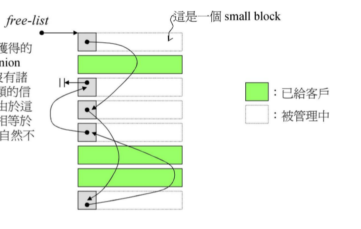

### 内存分配过程分析

**第一步**：初始的时候，这16根自由链表都是空的。


**第二步**：向pool_alloc申请一个32字节大小内存，这个时候可以分为pool_alloc会有如下几个动作：

1、向操作系统申请32 x 20 x 2 + RoundUp(0 >> 4)大小的内存，即1280字节内存，则目前累计的申请量为1280字节，将这些内存全部放到内存池中。

这个时候内存池的start_free为0，end_free为1280。

２、讲内存池分配出32 x 20大小的内存块，然后切分成20个小内存块，用３号自由链表串联起来，同时将３号链表的第一块内存分配给用户使用。这个时候

内存池的start_free为640，end_free为1280，因为从内存池分配出640个字节大小的内存。

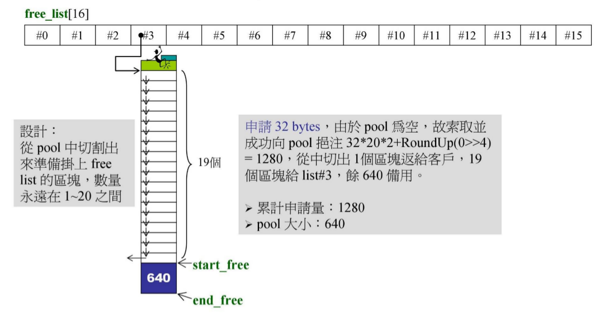

**第三步**：向pool_alloc申请一个64字节大小的内存，这个时候pool_alloc发现内存池中有640个字节的内存，就将他们全部取出来切成10块，然后用７号自由链表串联起来，将７号链表的头一块内存分配给用户使用。这个时候我们可以看到内存池的内存已经没了，则这个时候内存池的start_free=1280，end_free为1280。

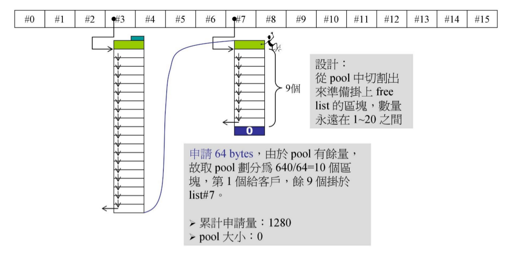

**第四步**：向pool_alloc申请大小为96字节大小的内存，这个时候需要重新向系统申请内存了，这次申请内存量为96 x 20 x 2 + RoundUp(1280 >> 4)大小的内存，即3920字节的内存，然后取出来1920字节大小的内存切成20块，用11号链表管理着，并将11号链表的第一块内存分配给用户使用。这个时候内存池的空闲是2000个字节。

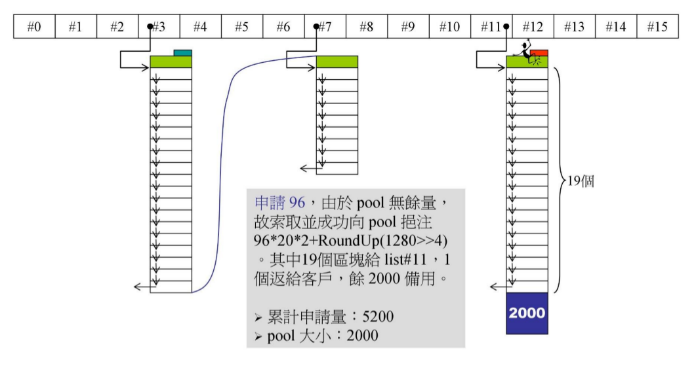

**第五步**：向pool_alloc申请88字节大小的内存块，然后发现内存池中有2000字节大小大内存，然后取出20 x 88大小的内存块切成20块用10号链表管理，讲10号链表的第一块内存分配给用户，这个时候系统中还剩240字节的内存。

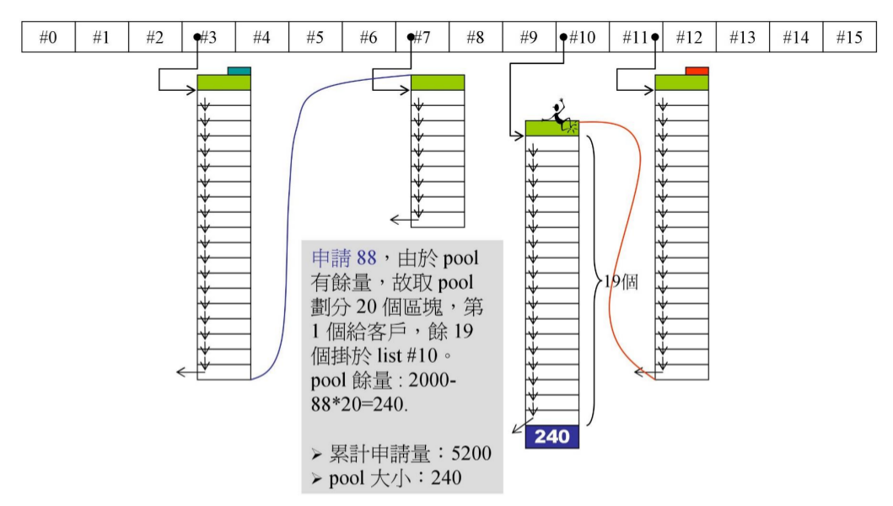

**第六步**：再向系统申请３次88字节大小的内存块，这个时候可以看到pool_alloc会从10号链表申请３块内存，然后10号自由链表向下移动三个位置。

但是内存池的内存量没有发生改变。

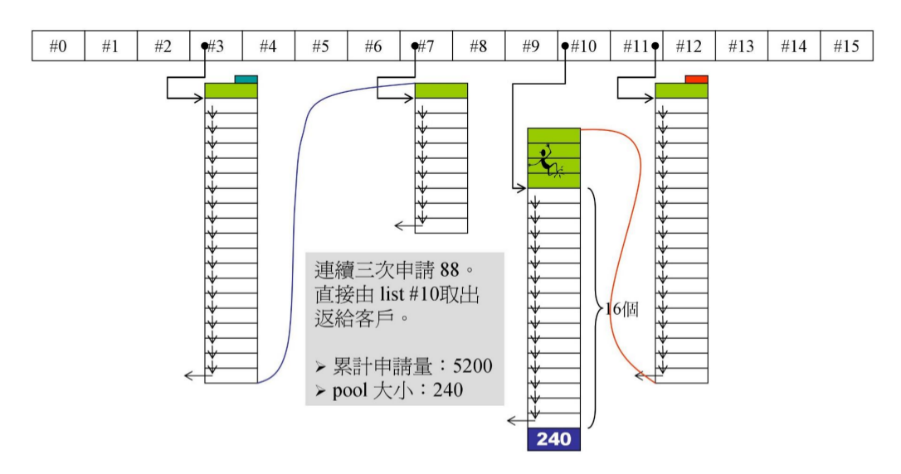

**第七步**：继续向pool_alloc申请一块大小为８字节的内存，这个时候从内存池中取出8 x 20字节大小的内存切块用０号链表管理，并将第一块内存给用户使用。

这个时候内存池中只剩下80字节的内存。

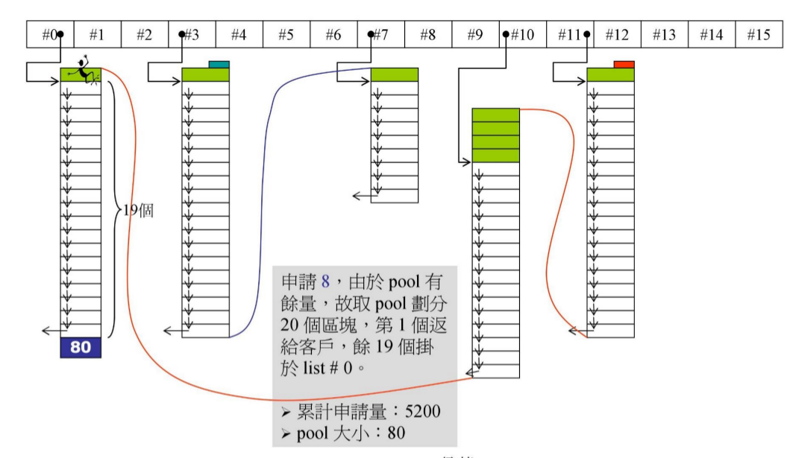

**第八步**：向pool_alloc申请104字节大小的内存，这个时候内存池剩余80字节的内存，很明显这80字节的内存无法满足要求，所以将这个内存给挂到了９号链表中，然后内存池的内存清空。向系统申请 104 * 20 * 2 + RoundUp(5200 >> 4)大小的内存，即目前的累计申请量为9688字节。然后划出2080字节切成20块，用１２号链表管理着，将第一块内存块分配给用户使用。这个时候内存池中剩余2408字节的内存。

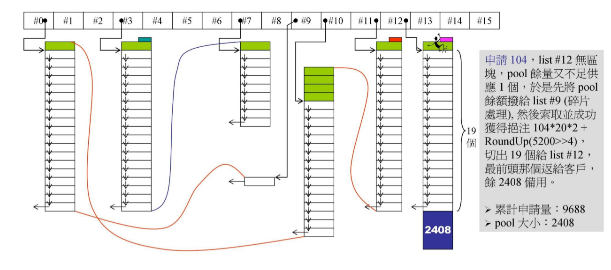

**第九步**：向系统申请112字节的内存，目前内存池中还有2408字节的内存，从里面取出2240字节的内存块，然后切成20块用13号链表管理，将第一块分配给用户使用。这个时候内存池中仅剩168字节的内存。

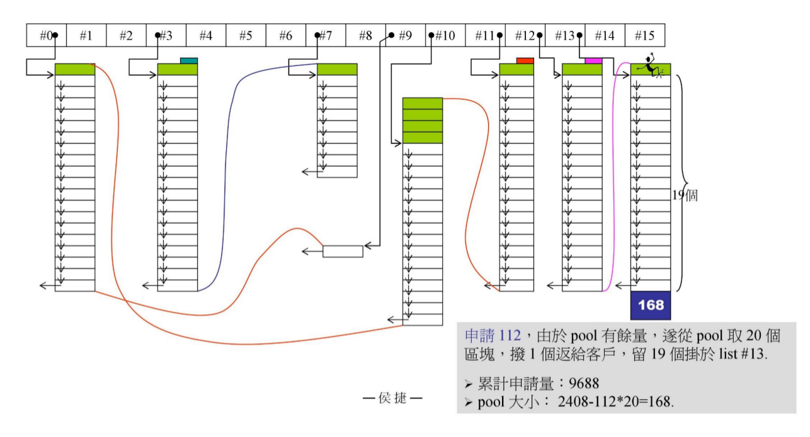

**第十步**：向pool_alloc申请48字节大小的内存块，然后目前内存池有168字节的内存，那就从内存池中取出3x48大小的内存，切块用３号链表管理，这个时候内存池中剩下24字节的内存。

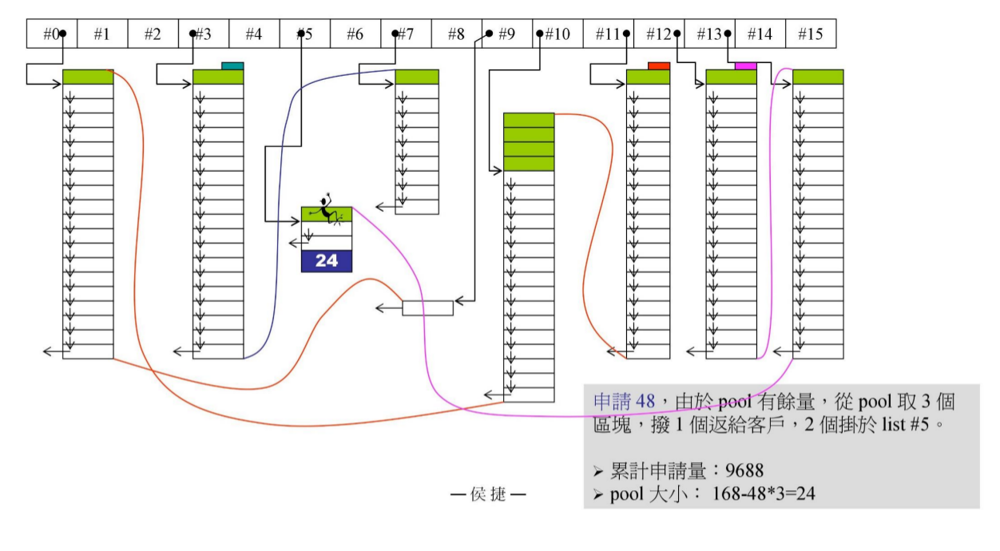

**第十一步**：向pool_alloc申请大小为72字节大小的内存，pool_alloc中第８号链表无可用的内存区块，然后看到内存池中只有24字节的内存，这个明显不够，所以将这24字节的内存甩到２号链表上，内存池剩余内存清零，然后又要向系统中申请，但是我们给系统做了限制，只能申请10000大小的内存块，因此这一次向系统申请的内存会失败，但是内存池不会就此认输，他会找找比８号码链表大的链表看看有没有空闲块，这个时候他找到９号链表中还有空闲的内存块，然后取出９号链表的一块内存放到内存池中即80字节，然后取出72字节内存挂到８号链表上，然后给用户使用，目前内存池中剩下８字节大小的内存。

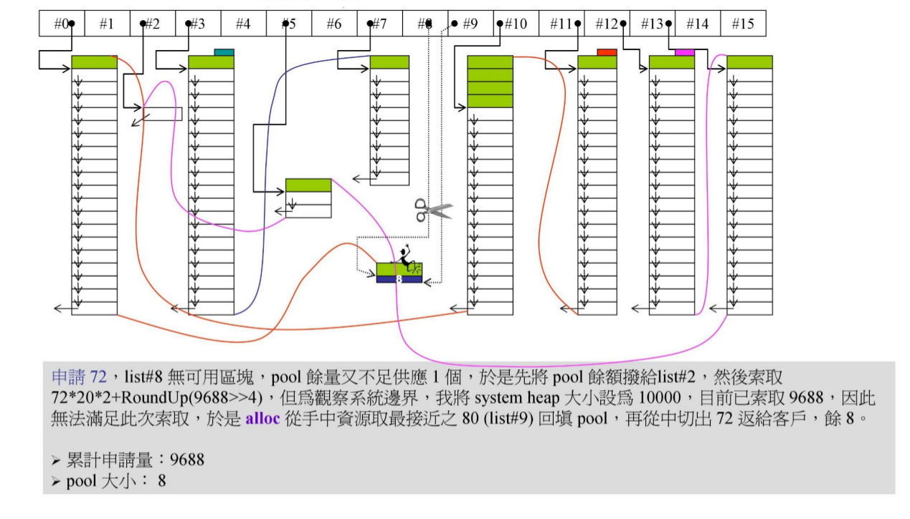

**第十二步**：再次向pool_alloc申请大小为72字节的内存，这个时候又遇到上面的问题，内存池内存不够用，然后系统内存也不够用，这个时候将内存池中的8字节内存放到0号链表上管理，然后再去向上找找有没有空闲的内存，发现９号链表已经没有内存块了，因为第１１步已经取用了，然后找到１０号链表那边还有内存，这个时候取用一块１０号链表的内存放入内存池中，然后切一块内存挂到８号链表上并给用户使用，然后内存池中只剩下１６字节内存。

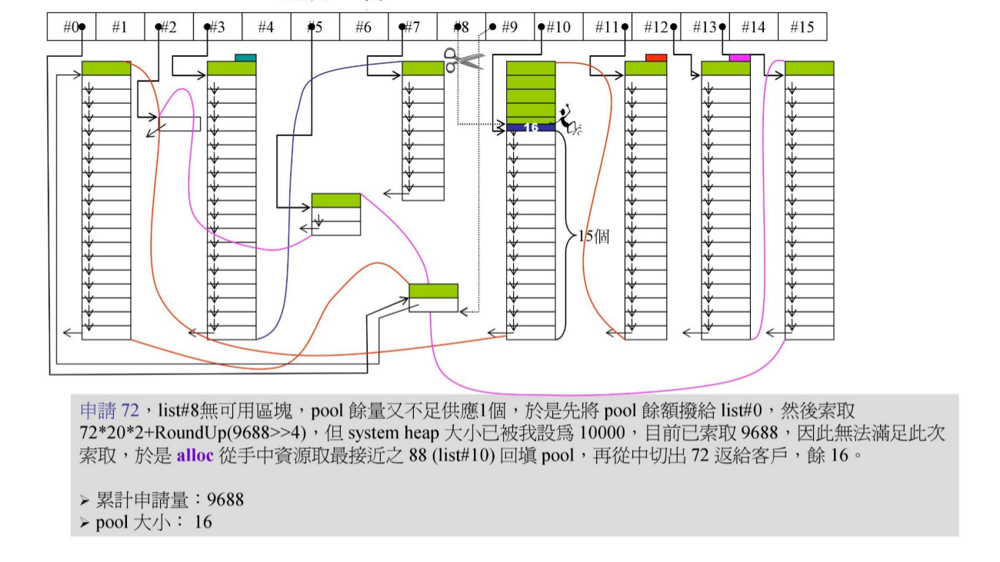

**第十三步**：这是最后一步，这个时候向系统申请１２０字节大小的，很明显内存池中的１６字节内存不够用，那么就将其挂到１号链表上，然后系统内存又不够用，那么只能向后面搜索看看有没有空闲的内存块，但是发现后面就是１５号链表，这个链表也没有空余内存，这个时候山穷水尽了，程序只能跑出异常然后挂了。

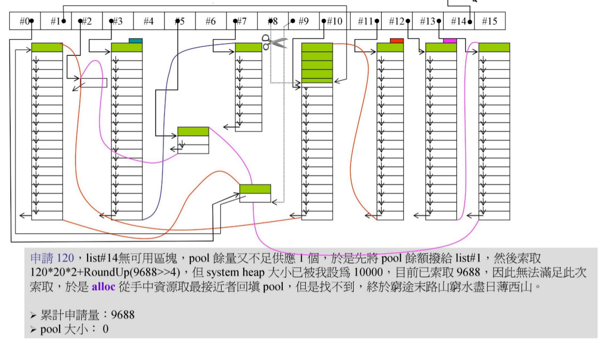

## 源码解读

参考[ext/pool_allocator.h](../../include/ext/pool_allocator.h)和[src/pool_allocator.cc](../../src/pool_allocator.cc)
